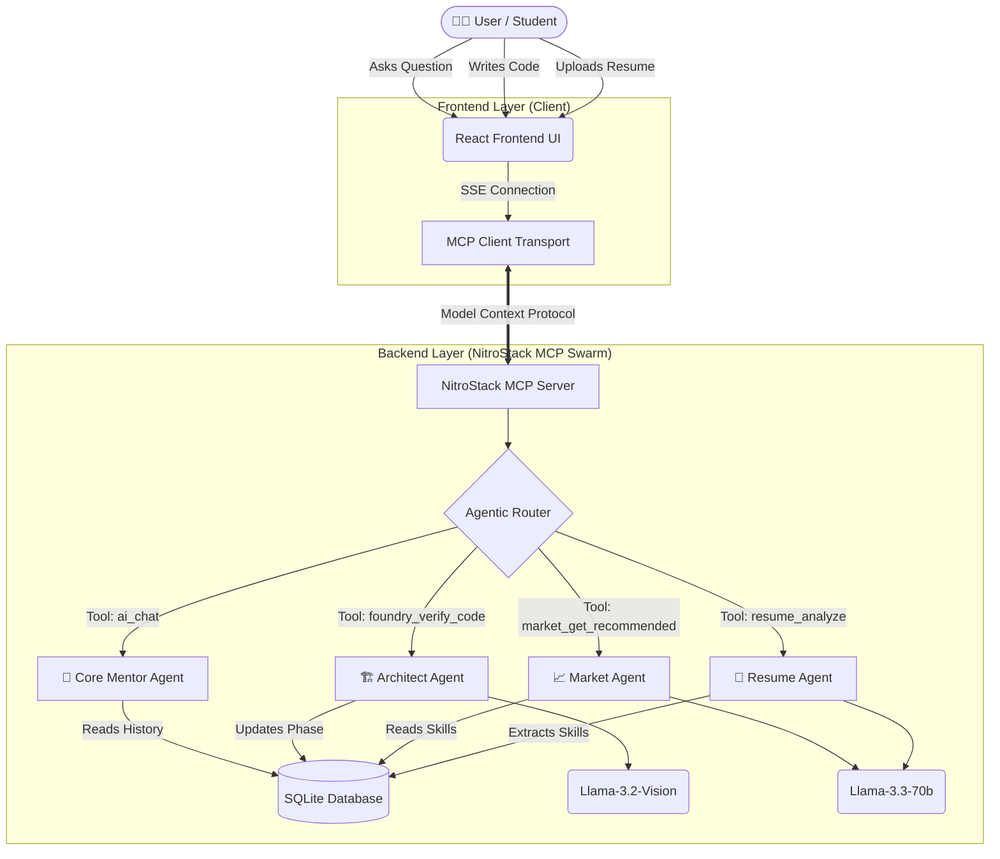

# EKALAVYA: The Agentic Career Acceleration Ecosystem 

<div align="center">
  <h3>The World's 1st Agentic AI Platform for Collaborative Career Learning</h3>
</div>

---

## 🛑 The Manifold Problem Statement

The modern education-to-employment pipeline is severely broken. Students and early-career professionals face a multifaceted, systemic crisis:

1. **The "Experience Paradox"**: Entry-level jobs strictly require experience, but students cannot get experience without a job.
2. **Generic Portfolios**: Students often build the same 3 tutorial-based projects (e.g., Todo apps, calculators, weather trackers). These fail to impress recruiters, show no business logic, and do not solve real-world problems.
3. **The Feedback Void**: Self-taught developers lack senior engineering oversight. They don't know if their code is scalable, clean, industry-standard, or secure.
4. **The Language Barrier**: In developing nations, brilliant minds are often held back by a lack of fluency in English, struggling to articulate their technical prowess and failing interviews despite strong coding skills.
5. **Passive AI Reliance**: Existing AI tools (like ChatGPT) encourage passive copying and pasting ("prompt-and-response") rather than active problem-solving, critical thinking, and logical deduction.
6. **Isolated Learning**: Traditional ed-tech platforms trap students in isolated silos. Software engineering is a team sport, yet learning platforms fail to simulate collaborative workspaces.

---

## 🎯 Multi-Layered Impactful Solutions

EKALAVYA tackles this manifold problem through a holistic, active, multi-layered approach:

*   **Layer 1: Deep Skill Auditing (Not Just Parsing)**: Instead of asking "what do you know?", the system deeply parses your raw resume and extracts a latent skills matrix to identify exact industry gaps based on real-time market data.
*   **Layer 2: Hyper-Personalized Project Generation**: The system does not give generic ideas. It generates unique, market-relevant project blueprints (in "The Foundry") tailored specifically to fill the precise gaps found in Layer 1.
*   **Layer 3: Supervised, Supercharged Execution**: EKALAVYA provides an integrated IDE environment where "The Architect" AI agent oversees your code, providing *hints* rather than raw answers, actively forcing you to learn.
*   **Layer 4: Vision-Based Verification**: You cannot fake progress. The AI uses Vision models to visually inspect screenshots of your UI and architecture to verify completion before unlocking the next milestone.
*   **Layer 5: Automated Translation to Value**: Once a project is verified, the AI automatically extracts your achievements and translates them into a professional, STAR-method (Situation, Task, Action, Result) resume ready for PDF export.
*   **Layer 6: Real-time Synchronized Collaboration**: As the first platform of its kind, Ekalavya features "Group Sessions" where users can generate a 6-digit sync code, join a shared Foundry workspace, and build alongside peers under the watchful eye of the Architect Agent.

---

## 🤖 Why is it "Agentic"? (Moving Beyond Prompt-Response)

EKALAVYA is fundamentally different from standard LLM wrappers. It does not use "Prompt-Response" logic; it uses **Stateful Agentic Routing**.

**Standard AI (Prompt-Response):**
*   User: "Give me a project idea."
*   AI: "Build a weather app." *(Interaction dies here, state is lost)*

**EKALAVYA (Agentic AI Logic):**
1. **Autonomous Tool Invocation**: Through the **Model Context Protocol (MCP)**, the AI acts as a central router. When you upload a resume, the LLM autonomously triggers a specific `resume_analyze` tool on the backend, formats the data, extracts JSON schemas, and stores it in the global database state.
2. **Stateful Context Memory**: The AI maintains a continuous, long-term memory of your skills, your current project phase, and your historical struggles. It knows if you struggled with React hooks 3 days ago and alters its guidance accordingly.
3. **Proactive Intervention**: The agents don't wait for your prompt. In "The Foundry," the Architect agent evaluates your milestone progress based on strict criteria and decides internally whether you pass or fail, using **Vision AI** to verify your UI screenshots before you even ask.
4. **Hierarchical Swarm Orchestration**: EKALAVYA utilizes a swarm of specialized agents that talk to each other, not just the user.

---

## 🧩 Exhaustive Feature Breakdown (Deep Dive)

### 1. 🧠 AI Career Mentor & SWOT Analysis (The Intelligence Core)
*   **Intelligent Resume Ingestion**: The system doesn't just read your PDF; it converts it into a structured semantic matrix. It maps your listed technologies against live industry demands for your target role.
*   **Dynamic SWOT Engine**: Automatically categorizes your profile into Strengths, Weaknesses, Opportunities, and Threats. If you apply for a "Frontend Developer" role but lack state management skills, it flags it as an immediate Threat and pivots the entire platform to teach you Redux/Zustand.
*   **Stateful Career Chatbot**: A dedicated AI mentor page that remembers every single interaction. It tracks your emotional progress, technical hurdles, and long-term goals over months of usage. 

### 2. 🧪 Project Lab (The Dynamic Blueprint Generator)
*   **Algorithmic Tailoring**: Projects are not hardcoded. The Market Agent dynamically spins up project blueprints organized into three tiers:
    *   **Easy Start**: To build confidence and introduce new syntax.
    *   **Skill Builder (Medium)**: To specifically target the "Weaknesses" identified in your SWOT analysis.
    *   **Tough Challenge (Hard)**: To build portfolio-defining applications that secure interviews.
*   **Phase-Based Architecture**: Every project is algorithmically broken down into 6 logical phases (Environment Setup, Core Logic, Database Integration, API Development, Frontend Integration, Deployment) before you write a single line of code.

### 3. 🏗️ The Foundry (The Supervised Execution IDE)
*   **Integrated Monaco Workspace**: You don't leave the platform to code. A fully integrated VS Code-like editor sits right inside the browser.
*   **"The Architect" (Anti-Cheat AI Mentor)**: The Architect observes your code in real-time. Crucially, **it refuses to write the code for you**. If you ask for the solution, it provides pseudo-code, architectural hints, or points out specific line-number errors, forcing the user to engage in active problem-solving.
*   **Vision-AI Visual Verification**: A massive leap over standard platforms. When you complete a UI phase, you upload a screenshot. The backend triggers a multimodal Llama-3.2-Vision agent to visually verify if your UI matches the acceptance criteria. You cannot advance to Phase 2 until Phase 1 passes visual inspection.

### 4. 👥 Group Sessions (1st Platform for Collaborative Learning)
*   **The Sync Code Architecture**: Learning software engineering alone is an anti-pattern. Ekalavya introduces real-time Group Sessions. A team lead creates a workspace and generates a 6-digit sync code.
*   **Shared AI Context**: When peers join via the code, they enter a shared Foundry. The AI Mentor watches the *group's* progress. If Student A breaks the database connection, the AI can explain the error to Student B, simulating a real-world Agile team environment.

### 5. 📄 Resume Architect AI (The Value Translator)
*   **Automated STAR Conversion**: The biggest hurdle for juniors is writing impactful resumes. The Resume Agent extracts the verified projects you built in The Foundry and autonomously rewrites them using the STAR method (Situation, Task, Action, Result).
*   **A4 Professional Templates**: Generates a stunning, side-by-side, ATS-friendly A4 layout with dynamic CSS rendering.
*   **High-Fidelity PDF Engine**: Converts your web resume into a perfectly scaled, professional PDF directly from the browser, ready to be sent to recruiters.

### 6. 💼 Job Hub (Smart Market Matching)
*   **Skill-Delta Matching**: The platform filters real-world job listings not just by keyword, but by the "Skill Delta." It knows exactly what you learned in The Foundry yesterday, and immediately surfaces job postings that require that specific newly acquired skill.

### 7. 🌏 Multilingual Cultural Support (The Equalizer)
*   **Tamil Mode (தமிழ்)**: A cultural context toggle that transforms the entire AI persona. It speaks in a colloquial mix of Tamil and English technical jargon. This is specifically designed to help students in rural/tier-3 cities in India bridge the cognitive language gap without losing technical precision, leveling the playing field for global opportunities.

---

## 🏛️ Comprehensive Architecture & Workflow

Ekalavya is built using a modern decoupled architecture, strictly adhering to the **Model Context Protocol (MCP)** standard via the **NitroStack SDK**. 

### The Hierarchical Agent Workflow Diagram



### How MCP is Properly Implemented

Instead of using traditional REST APIs (`fetch`, `axios`), Ekalavya implements the **Model Context Protocol (MCP)**. This is exactly in line with Hackathon requirements:
1. **Server-Sent Events (SSE)**: The backend (`ekalavya-2.0`) exposes an SSE stream at `http://localhost:3000/sse`.
2. **Context Provider**: The React frontend uses `@modelcontextprotocol/sdk` to establish a persistent connection.
3. **Tool Calls**: When the user performs an action (e.g., clicks "Start Project"), the frontend dispatches an MCP `callTool` request (e.g., `foundry_start_project`).
4. **Agent Execution**: The NitroStack server routes this to the specific Agent module, which executes the business logic, interacts with the LLM, reads/writes to Prisma, and returns a structured JSON response back through the MCP stream.

---

## 💻 Technical Stack Tabulation (Yes, it complies with the rules!)

**Regarding Hackathon Rules**: Yes, this stack perfectly complies! The rules explicitly state to use **NitroStack SDK + MCP Protocol** and prohibit standard Next.js/Express REST wrappers. We are completely compliant by relying exclusively on MCP `callTool` and SSE transports.

| Layer | Technology / Tool | Purpose & Justification |
| :--- | :--- | :--- |
| **Frontend UI** | React (Vite) | Lightning-fast HMR, component-based architecture for complex dashboards. |
| **Styling** | Tailwind CSS & Framer Motion | Rapid UI prototyping, glassmorphism aesthetics, and fluid micro-animations. |
| **Editor Integration**| Monaco Editor | Provides a native VS Code-like coding experience directly in the browser. |
| **Client Transport** | `@modelcontextprotocol/sdk` | Maintains persistent SSE connections and handles tool-call routing from the client. |
| **Backend Core** | NitroStack TypeScript SDK | Official framework for building robust, modular MCP servers and agent tools. |
| **Database** | SQLite & Prisma ORM | Lightweight, zero-config relational database with strict TypeScript schema safety. |
| **AI Models (Logic)**| Llama-3.3-70b | High-reasoning open-source model for complex career strategy and code analysis. |
| **AI Models (Vision)**| Llama-3.2-90b-vision | Multimodal capability to visually verify UI screenshots and wireframes. |

---

## ⚙️ Environment Setup & Installation

### Prerequisites
*   Node.js (v18 or v20.x recommended)
*   `npm` or `pnpm`
*   Nitro Studio (for deployment and local MCP routing)

### 1. Backend Setup (The MCP Server)
The core agentic logic lives in the `ekalavya-2.0` directory.

```bash
# Navigate to the backend directory
cd ekalavya-2.0

# Install dependencies
npm install

# Start the MCP Server via NitroStack CLI in Production HTTP mode
npm run start
# The server will spin up and listen for SSE connections on http://localhost:3000/sse
```

### 2. Frontend Setup (The React UI)
Open a new, separate terminal for the frontend UI.

```bash
# Navigate to the frontend directory
cd frontend

# Install dependencies
npm install

# Start the Vite development server
npm run dev
# The UI will start on http://localhost:5174
```

---

## 🚀 Deployment (NitroCloud)

1. Open the **Nitro Studio** desktop app.
2. Click **Add Server** -> **Nitro Project**.
3. Select the `ekalavya-2.0` folder.
4. Click **Deploy to NitroCloud** in the Studio header to deploy the MCP server globally.
5. Once deployed, update your frontend `MCPProvider.jsx` to point to the new Live URL instead of `localhost`.
